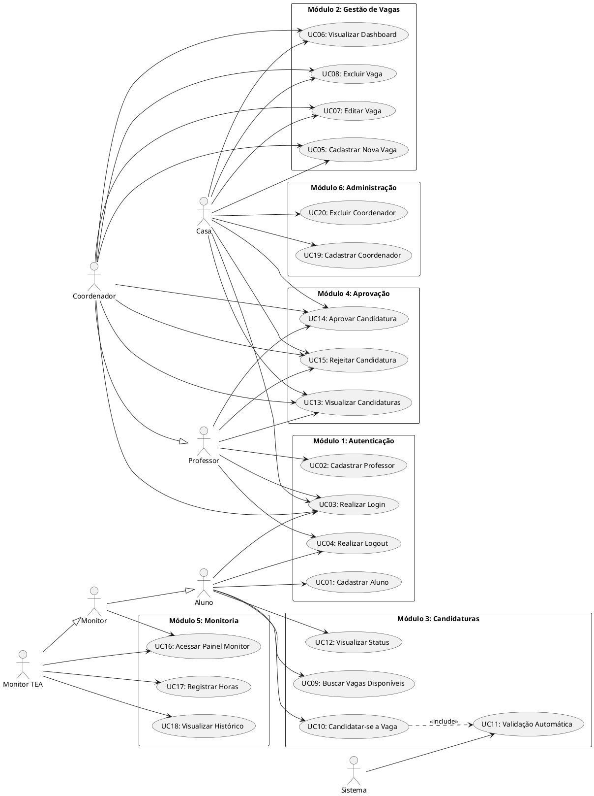
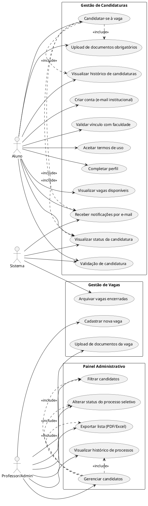

# Documento de Casos de Uso – Sistema de Monitoria IBMEC

## Descrição
Este documento apresenta todos os **Casos de Uso** implementados no Sistema de Monitoria IBMEC. Cada caso de uso reflete fielmente as funcionalidades desenvolvidas no sistema, incluindo atores, fluxos, pré-condições e regras de negócio validadas.

## Atores do Sistema

| Ator | Descrição | User Type |
|------|-----------|-----------|
| **Aluno** | Estudante matriculado que busca e candidata-se a vagas de monitoria | `aluno` |
| **Monitor** | Aluno aprovado que atua como monitor voluntário | `monitor` |
| **Monitor TEA** | Aluno aprovado que atua como monitor remunerado e registra horas | `monitor_tea` |
| **Professor** | Docente que aprova ou rejeita candidaturas | `professor` |
| **Coordenador** | Professor com permissões para criar vagas e gerenciar monitoria | `coordenador` |
| **Casa (Admin)** | Administrador do sistema com permissões totais | `casa` |
| **Sistema** | Ator que executa validações e processos automatizados | - |

---

## Padrão de Documentação
**Título** | **Ator(es)** | **Descrição** | **Pré-condição** | **Fluxo Principal** | **Fluxos Alternativos** | **Pós-condição** | **Regras de Negócio**

---

## MÓDULO 1: Autenticação e Cadastro

### UC01 - Cadastrar Aluno
**Ator:** Aluno (não autenticado)  
**Descrição:** Permite que estudante crie conta no sistema informando dados pessoais e acadêmicos.  
**Pré-condição:** Não possuir cadastro prévio com mesmo email ou matrícula.  
**Fluxo Principal:**  
1. Aluno acessa página de cadastro (`/cadastro_aluno/`)
2. Aluno preenche formulário com: nome, email, matrícula, telefone, curso, CR geral, senha
3. Sistema valida unicidade de email e matrícula
4. Sistema criptografa senha com bcrypt
5. Sistema cria registro de Aluno no banco
6. Sistema autentica automaticamente o aluno
7. Sistema redireciona para painel de aluno

**Fluxos Alternativos:**  
a. Email já cadastrado: Sistema exibe mensagem "Email já cadastrado" e permanece na página  
b. Matrícula já cadastrada: Sistema exibe mensagem "Matrícula já cadastrada"  
c. CR geral < 0 ou > 10: Sistema rejeita entrada (validação HTML5)  
d. Senha fraca: Sistema recomenda senha forte (mínimo 8 caracteres)

**Pós-condição:** Aluno cadastrado, autenticado e redirecionado para painel.  
**Regras de Negócio:**  
- RN01: Matrícula deve ter exatamente 12 caracteres
- RN02: CR geral deve estar entre 0.0 e 10.0
- RN03: Email deve ser único no sistema
- RN04: Senha armazenada como hash bcrypt

---

### UC02 - Cadastrar Professor
**Ator:** Professor (não autenticado)  
**Descrição:** Permite que docente crie conta no sistema.  
**Pré-condição:** Não possuir cadastro prévio com mesmo email ou CPF.  
**Fluxo Principal:**  
1. Professor acessa página de cadastro (`/cadastro_professor/`)
2. Professor preenche: nome, email, CPF, telefone, senha
3. Sistema valida formato e unicidade de CPF
4. Sistema valida unicidade de email
5. Sistema criptografa senha
6. Sistema cria registro de Professor
7. Sistema autentica automaticamente
8. Sistema redireciona para painel de professor

**Fluxos Alternativos:**  
a. CPF já cadastrado: Sistema exibe mensagem de erro  
b. CPF inválido: Sistema valida formato (14 caracteres com máscara)  
c. Email duplicado: Sistema informa que email já existe

**Pós-condição:** Professor cadastrado e autenticado.  
**Regras de Negócio:**  
- RN05: CPF deve ter exatamente 14 caracteres (formato: XXX.XXX.XXX-XX)
- RN06: CPF deve ser único no sistema

---

### UC03 - Realizar Login
**Ator:** Qualquer usuário não autenticado  
**Descrição:** Permite autenticação no sistema através de email e senha.  
**Pré-condição:** Usuário cadastrado no sistema.  
**Fluxo Principal:**  
1. Usuário acessa página de login (`/login/`)
2. Usuário informa email e senha
3. Sistema busca usuário em todas as tabelas (Aluno, Professor, Coordenador, Casa)
4. Sistema verifica hash da senha com bcrypt
5. Sistema identifica tipo de usuário (aluno/professor/coordenador/casa/monitor)
6. Sistema cria sessão com `user_id`, `user_type`, `user_name`
7. Sistema redireciona conforme perfil:
   - Aluno → `/painel_aluno/`
   - Professor → `/painel_professor/`
   - Coordenador → `/painel_coordenador/`
   - Casa → `/dashboard/`
   - Monitor → `/painel_monitor/`

**Fluxos Alternativos:**  
a. Email não encontrado: Sistema exibe "Email ou senha inválidos"  
b. Senha incorreta: Sistema exibe "Email ou senha inválidos" (segurança)  
c. Usuário já autenticado: Sistema redireciona diretamente ao painel

**Pós-condição:** Sessão criada e usuário redirecionado ao painel apropriado.  
**Regras de Negócio:**  
- RN07: Mensagens genéricas para falhas de autenticação (segurança)
- RN08: Monitor identificado automaticamente se existe em tabela Monitor

---

### UC04 - Realizar Logout
**Ator:** Qualquer usuário autenticado  
**Descrição:** Encerra sessão do usuário e redireciona para login.  
**Pré-condição:** Usuário autenticado.  
**Fluxo Principal:**  
1. Usuário clica em "Sair" no menu
2. Sistema executa `request.session.flush()`
3. Sistema redireciona para `/login/`

**Pós-condição:** Sessão destruída, usuário desautenticado.  
**Regras de Negócio:**  
- RN09: Flush limpa todas as variáveis de sessão

---

## MÓDULO 2: Gestão de Vagas (Coordenador/Casa)

### UC05 - Cadastrar Nova Vaga
**Ator:** Coordenador, Casa  
**Descrição:** Permite criação de nova vaga de monitoria para disciplina específica.  
**Pré-condição:** Usuário autenticado como coordenador ou casa.  
**Fluxo Principal:**  
1. Coordenador acessa `/cadastro_vaga/`
2. Sistema valida permissão (user_type in ['coordenador', 'casa'])
3. Coordenador preenche formulário:
   - Disciplina (select)
   - Título da vaga
   - Pré-requisitos (textarea)
   - Tipo de monitoria (Monitor ou Monitor TEA)
   - Prazo de inscrição (date)
4. Sistema valida prazo de inscrição > data atual
5. Sistema cria VagaMonitoria vinculada ao coordenador logado
6. Sistema define status padrão como 'Aberta'
7. Sistema redireciona para dashboard

**Fluxos Alternativos:**  
a. Professor tenta acessar: Sistema redireciona com mensagem "Acesso negado"  
b. Prazo no passado: Sistema rejeita com mensagem de erro  
c. Disciplina não selecionada: Validação HTML5 impede envio

**Pós-condição:** Vaga criada e disponível para candidaturas.  
**Regras de Negócio:**  
- RN10: Apenas coordenadores e Casa podem criar vagas
- RN11: Prazo de inscrição deve ser futuro
- RN12: Status inicial sempre 'Aberta'
- RN13: Vaga vinculada ao coordenador criador

---

### UC06 - Visualizar Dashboard de Vagas
**Ator:** Coordenador, Casa  
**Descrição:** Exibe painel com todas as vagas, candidaturas e monitores.  
**Pré-condição:** Usuário autenticado como coordenador ou casa.  
**Fluxo Principal:**  
1. Coordenador acessa `/dashboard/`
2. Sistema valida permissão (user_type in ['coordenador', 'casa'])
3. Sistema carrega:
   - Total de vagas abertas
   - Total de candidaturas pendentes
   - Total de monitores ativos
   - Lista completa de vagas com informações de disciplina e candidaturas
4. Sistema exibe dashboard com estatísticas e tabelas

**Fluxos Alternativos:**  
a. Professor tenta acessar: Redirecionado com "Acesso negado"  
b. Aluno tenta acessar: Redirecionado com "Acesso negado"

**Pós-condição:** Dashboard exibido com dados atualizados.  
**Regras de Negócio:**  
- RN14: Apenas coordenadores e Casa têm acesso ao dashboard completo
- RN15: Professor NÃO pode acessar dashboard

---

### UC07 - Editar Vaga
**Ator:** Coordenador, Casa  
**Descrição:** Permite atualizar informações de vaga existente.  
**Pré-condição:** Vaga cadastrada no sistema.  
**Fluxo Principal:**  
1. Coordenador acessa `/editar_vaga/<vaga_id>/`
2. Sistema carrega dados atuais da vaga
3. Coordenador modifica campos desejados
4. Sistema valida alterações
5. Sistema salva modificações
6. Sistema redireciona para dashboard

**Fluxos Alternativos:**  
a. Vaga não encontrada: Sistema retorna 404  
b. Prazo alterado para passado: Sistema rejeita

**Pós-condição:** Vaga atualizada no banco de dados.  
**Regras de Negócio:**  
- RN16: Apenas coordenadores e Casa podem editar vagas

---

### UC08 - Excluir Vaga
**Ator:** Coordenador, Casa  
**Descrição:** Remove vaga do sistema permanentemente.  
**Pré-condição:** Vaga cadastrada, sem candidaturas aprovadas.  
**Fluxo Principal:**  
1. Coordenador acessa `/deletar_vaga/<vaga_id>/`
2. Sistema verifica se há candidaturas aprovadas
3. Sistema deleta vaga (cascata deleta candidaturas pendentes)
4. Sistema redireciona para dashboard

**Fluxos Alternativos:**  
a. Vaga com candidaturas aprovadas: Sistema impede exclusão (integridade)

**Pós-condição:** Vaga removida do banco.  
**Regras de Negócio:**  
- RN17: Não pode deletar vaga com monitores ativos

---

## MÓDULO 3: Candidaturas (Aluno)

### UC09 - Buscar Vagas Disponíveis
**Ator:** Aluno  
**Descrição:** Permite visualizar todas as vagas abertas para candidatura.  
**Pré-condição:** Aluno autenticado.  
**Fluxo Principal:**  
1. Aluno acessa painel (`/painel_aluno/`)
2. Sistema busca VagaMonitoria com status='Aberta'
3. Sistema filtra vagas com prazo_inscricao >= data_atual
4. Sistema exibe lista de vagas com:
   - Título
   - Disciplina
   - Tipo de monitoria
   - Pré-requisitos
   - Prazo de inscrição
   - Botão "Candidatar-se"

**Pós-condição:** Vagas disponíveis exibidas.  
**Regras de Negócio:**  
- RN18: Apenas vagas abertas são exibidas
- RN19: Vagas com prazo expirado não aparecem

---

### UC10 - Candidatar-se a Vaga
**Ator:** Aluno  
**Descrição:** Permite enviar candidatura para vaga de monitoria.  
**Pré-condição:** Aluno autenticado, vaga aberta, CR válido.  
**Fluxo Principal:**  
1. Aluno clica em "Candidatar-se" na vaga desejada
2. Sistema redireciona para `/candidatar_vaga/<vaga_id>/`
3. Aluno preenche formulário:
   - CR na disciplina específica
   - Documentos/informações adicionais (textarea)
4. Sistema executa validação automática (<<include>> UC11)
5. Sistema cria Candidatura com status='Pendente'
6. Sistema vincula candidatura ao aluno e vaga
7. Sistema redireciona para painel com mensagem de sucesso

**Fluxos Alternativos:**  
a. CR geral < 7.0: Sistema bloqueia com mensagem "CR geral insuficiente (mínimo 7.0)"  
b. CR disciplina < 8.0: Sistema bloqueia com "CR na disciplina insuficiente (mínimo 8.0)"  
c. Candidatura duplicada: Sistema impede (constraint unique_together)  
d. Vaga fechada: Sistema redireciona com mensagem "Vaga não disponível"

**Pós-condição:** Candidatura criada com status Pendente.  
**Regras de Negócio:**  
- RN20: CR geral mínimo: 7.0
- RN21: CR disciplina mínimo: 8.0
- RN22: Não permite candidaturas duplicadas (aluno + vaga)
- RN23: Status inicial sempre 'Pendente'

---

### UC11 - Validação Automática de Candidatura
**Ator:** Sistema  
**Descrição:** Valida automaticamente critérios de elegibilidade antes de permitir candidatura.  
**Pré-condição:** Aluno iniciou processo de candidatura.  
**Fluxo Principal:**  
1. Sistema consulta aluno.cr_geral
2. Sistema verifica cr_geral >= 7.0
3. Sistema consulta cr_disciplina informado
4. Sistema verifica cr_disciplina >= 8.0
5. Se ambos válidos, sistema permite prosseguir

**Fluxos Alternativos:**  
a. cr_geral < 7.0: Sistema exibe mensagem e bloqueia  
b. cr_disciplina < 8.0: Sistema exibe mensagem e bloqueia

**Pós-condição:** Elegibilidade validada ou candidatura bloqueada.  
**Regras de Negócio:**  
- RN24: Validação executada no método `validarCR()` do modelo Candidatura
- RN25: Ambos os CRs devem atender aos critérios

---

### UC12 - Visualizar Status de Candidatura
**Ator:** Aluno  
**Descrição:** Permite acompanhar situação atual de candidaturas realizadas.  
**Pré-condição:** Aluno possui candidaturas registradas.  
**Fluxo Principal:**  
1. Aluno acessa painel (`/painel_aluno/`)
2. Sistema busca candidaturas do aluno
3. Sistema exibe lista com:
   - Título da vaga
   - Disciplina
   - Status (Pendente/Aprovada/Rejeitada)
   - Data da candidatura
   - Badge colorido conforme status

**Pós-condição:** Status de candidaturas visualizado.  
**Regras de Negócio:**  
- RN26: Status podem ser: Pendente (amarelo), Aprovada (verde), Rejeitada (vermelho)

---

## MÓDULO 4: Aprovação de Candidaturas (Professor/Coordenador/Casa)

### UC13 - Visualizar Candidaturas
**Ator:** Professor, Coordenador, Casa  
**Descrição:** Permite visualizar todas as candidaturas para análise.  
**Pré-condição:** Usuário autenticado como professor, coordenador ou casa.  
**Fluxo Principal:**  
1. Usuário acessa painel apropriado
2. Sistema busca todas candidaturas pendentes
3. Sistema exibe lista com:
   - Nome do aluno
   - Matrícula
   - Vaga pretendida
   - CR geral
   - CR na disciplina
   - Documentos
   - Botões Aprovar/Rejeitar

**Pós-condição:** Candidaturas exibidas para avaliação.  
**Regras de Negócio:**  
- RN27: Professores, coordenadores e Casa podem visualizar candidaturas

---

### UC14 - Aprovar Candidatura
**Ator:** Professor, Coordenador, Casa  
**Descrição:** Aprova candidatura de aluno e cria registro de Monitor.  
**Pré-condição:** Candidatura com status 'Pendente'.  
**Fluxo Principal:**  
1. Usuário clica em "Aprovar" na candidatura
2. Sistema redireciona para `/aprovar_candidatura/<candidatura_id>/`
3. Sistema valida permissão (user_type in ['professor', 'coordenador', 'casa'])
4. Sistema atualiza status da candidatura para 'Aprovada'
5. Sistema identifica tipo de monitoria da vaga
6. Se tipo='Monitor': Sistema cria/atualiza registro em tabela Monitor (get_or_create)
7. Se tipo='MonitorTEA': Sistema cria/atualiza registro em tabela MonitorTEA
8. Sistema redireciona para painel com mensagem "Candidatura aprovada com sucesso"

**Fluxos Alternativos:**  
a. Candidatura já processada: Sistema exibe mensagem de erro  
b. Aluno tenta aprovar: Sistema nega acesso

**Pós-condição:** Candidatura aprovada, Monitor criado, aluno pode acessar painel de monitor.  
**Regras de Negócio:**  
- RN28: Aprovação cria automaticamente registro de Monitor ou MonitorTEA
- RN29: Uso de get_or_create evita duplicação de monitores
- RN30: Alunos NÃO podem aprovar candidaturas

---

### UC15 - Rejeitar Candidatura
**Ator:** Professor, Coordenador, Casa  
**Descrição:** Rejeita candidatura de aluno com justificativa.  
**Pré-condição:** Candidatura com status 'Pendente'.  
**Fluxo Principal:**  
1. Usuário clica em "Rejeitar"
2. Sistema redireciona para `/rejeitar_candidatura/<candidatura_id>/`
3. Sistema valida permissão
4. Sistema atualiza status para 'Rejeitada'
5. Sistema salva candidatura
6. Sistema redireciona com mensagem "Candidatura rejeitada"

**Fluxos Alternativos:**  
a. Candidatura já processada: Sistema informa status atual

**Pós-condição:** Candidatura rejeitada, aluno pode visualizar status.  
**Regras de Negócio:**  
- RN31: Candidatura rejeitada não cria Monitor
- RN32: Status rejeitado é final (não pode ser alterado novamente)

---

## MÓDULO 5: Gestão de Monitoria (Monitor TEA)

### UC16 - Acessar Painel de Monitor
**Ator:** Monitor, Monitor TEA  
**Descrição:** Permite acesso a painel específico para monitores aprovados.  
**Pré-condição:** Aluno aprovado como monitor (existe registro em tabela Monitor ou MonitorTEA).  
**Fluxo Principal:**  
1. Monitor realiza login
2. Sistema identifica que existe registro em tabela Monitor
3. Sistema define user_type='monitor'
4. Sistema redireciona para `/painel_monitor/`
5. Sistema exibe informações de monitoria ativa

**Pós-condição:** Painel de monitor exibido.  
**Regras de Negócio:**  
- RN33: Apenas alunos aprovados podem acessar painel de monitor
- RN34: Verificação automática no login

---

### UC17 - Registrar Horas de Monitoria
**Ator:** Monitor TEA  
**Descrição:** Permite registro detalhado de horas trabalhadas e atividades realizadas.  
**Pré-condição:** Monitor TEA autenticado, possui candidatura aprovada.  
**Fluxo Principal:**  
1. Monitor TEA acessa `/registrar_monitoria/`
2. Monitor TEA preenche formulário:
   - Data da monitoria
   - Horário início e fim
   - Descrição das atividades
   - Alunos participantes (nome e matrícula - JSON)
   - Observações opcionais
3. Sistema calcula horas_trabalhadas automaticamente
4. Sistema extrai quantidade_alunos do JSON
5. Sistema vincula registro ao MonitorTEA e Candidatura
6. Sistema salva RegistroMonitoria
7. Sistema redireciona com mensagem "Registro salvo com sucesso"

**Fluxos Alternativos:**  
a. Data futura: Sistema rejeita com erro  
b. Horário fim < horário início: Sistema alerta para correção  
c. JSON inválido: Sistema exibe erro de formato

**Pós-condição:** Registro de monitoria salvo e vinculado.  
**Regras de Negócio:**  
- RN35: Apenas Monitor TEA pode registrar horas
- RN36: Horas calculadas automaticamente (fim - início)
- RN37: Alunos armazenados como JSON para flexibilidade
- RN38: Registro vinculado à candidatura aprovada

---

### UC18 - Visualizar Histórico de Monitorias
**Ator:** Monitor TEA  
**Descrição:** Permite consultar todos os registros de monitoria realizados.  
**Pré-condição:** Monitor TEA com registros cadastrados.  
**Fluxo Principal:**  
1. Monitor TEA acessa painel
2. Sistema busca RegistroMonitoria filtrado por monitor_tea
3. Sistema ordena por data_monitoria (DESC)
4. Sistema exibe lista com:
   - Data e horários
   - Horas trabalhadas
   - Disciplina
   - Quantidade de alunos
   - Descrição de atividade

**Pós-condição:** Histórico de monitorias visualizado.  
**Regras de Negócio:**  
- RN39: Ordenação decrescente por data (mais recentes primeiro)

---

## MÓDULO 6: Administração (Casa)

### UC19 - Cadastrar Coordenador
**Ator:** Casa  
**Descrição:** Permite criação de novo coordenador no sistema.  
**Pré-condição:** Casa autenticado.  
**Fluxo Principal:**  
1. Casa acessa `/cadastro_coordenador/`
2. Casa preenche: nome, email, CPF, telefone, senha
3. Sistema valida unicidade de CPF e email
4. Sistema cria registro de Coordenador (herda de Professor)
5. Sistema redireciona para painel Casa

**Fluxos Alternativos:**  
a. CPF duplicado: Sistema alerta  
b. Email existente: Sistema informa

**Pós-condição:** Coordenador cadastrado e pode fazer login.  
**Regras de Negócio:**  
- RN40: Apenas Casa pode cadastrar coordenadores
- RN41: Coordenador herda permissões de Professor + permissões de gestão

---

### UC20 - Excluir Coordenador
**Ator:** Casa  
**Descrição:** Remove coordenador do sistema.  
**Pré-condição:** Coordenador cadastrado.  
**Fluxo Principal:**  
1. Casa seleciona coordenador
2. Casa confirma exclusão
3. Sistema verifica dependências (vagas criadas)
4. Sistema deleta coordenador
5. Sistema redireciona com confirmação

**Fluxos Alternativos:**  
a. Coordenador com vagas ativas: Sistema solicita reatribuição ou cancela operação

**Pós-condição:** Coordenador removido.  
**Regras de Negócio:**  
- RN42: Verificar integridade referencial antes de deletar

---

## Diagrama de Casos de Uso



---

## Matriz de Rastreabilidade

| Caso de Uso | Views Implementadas | Models Envolvidos | Permissões |
|-------------|---------------------|-------------------|------------|
| UC01 | `cadastro_aluno` | Aluno | Público |
| UC02 | `cadastro_professor` | Professor | Público |
| UC03 | `login` | Aluno, Professor, Coordenador, Casa, Monitor | Público |
| UC04 | `logout` | - | Autenticado |
| UC05 | `cadastro_vaga` | VagaMonitoria, Disciplina, Coordenador | coordenador, casa |
| UC06 | `dashboard` | VagaMonitoria, Candidatura, Monitor | coordenador, casa |
| UC07 | `editar_vaga` | VagaMonitoria | coordenador, casa |
| UC08 | `deletar_vaga` | VagaMonitoria | coordenador, casa |
| UC09 | `painel_aluno` | VagaMonitoria | aluno |
| UC10 | `candidatar_vaga` | Candidatura, Aluno, VagaMonitoria | aluno |
| UC11 | `Candidatura.validarCR()` | Candidatura, Aluno | sistema |
| UC12 | `painel_aluno` | Candidatura | aluno |
| UC13 | `painel_professor`, `painel_coordenador` | Candidatura | professor, coordenador, casa |
| UC14 | `aprovar_candidatura` | Candidatura, Monitor, MonitorTEA | professor, coordenador, casa |
| UC15 | `rejeitar_candidatura` | Candidatura | professor, coordenador, casa |
| UC16 | `painel_monitor` | Monitor, MonitorTEA | monitor |
| UC17 | `registrar_monitoria` | RegistroMonitoria, MonitorTEA, Candidatura | monitor_tea |
| UC18 | `painel_monitor` | RegistroMonitoria | monitor_tea |
| UC19 | `cadastro_coordenador` | Coordenador | casa |
| UC20 | `deletar_coordenador` | Coordenador | casa |

---

## Regras de Negócio Consolidadas

| ID | Regra | Descrição |
|----|-------|-----------|
| RN01 | Matrícula única | Matrícula deve ter 12 caracteres e ser única no sistema |
| RN02 | Validação CR geral | CR geral deve estar entre 0.0 e 10.0 |
| RN03 | Email único | Email não pode ser duplicado em nenhuma tabela de usuários |
| RN04 | Criptografia senha | Todas as senhas armazenadas como hash bcrypt |
| RN05 | Formato CPF | CPF deve ter exatamente 14 caracteres (XXX.XXX.XXX-XX) |
| RN06 | CPF único | CPF deve ser único entre todos os professores |
| RN07 | Mensagens genéricas | Falhas de login não devem revelar se email existe (segurança) |
| RN08 | Detecção automática monitor | Sistema identifica monitor automaticamente ao fazer login |
| RN09 | Flush de sessão | Logout deve limpar todas as variáveis de sessão |
| RN10 | Permissão criar vaga | Apenas coordenadores e Casa podem criar vagas |
| RN11 | Prazo futuro | Prazo de inscrição deve ser maior que data atual |
| RN12 | Status inicial vaga | Toda vaga criada tem status inicial 'Aberta' |
| RN13 | Vínculo coordenador | Vaga sempre vinculada ao coordenador que criou |
| RN14 | Acesso dashboard | Apenas coordenadores e Casa podem acessar dashboard completo |
| RN15 | Restrição professor | Professor NÃO pode acessar dashboard nem criar vagas |
| RN16 | Edição de vaga | Apenas coordenadores e Casa podem editar vagas |
| RN17 | Integridade vaga | Não pode deletar vaga com candidaturas aprovadas/monitores ativos |
| RN18 | Filtro vagas abertas | Apenas vagas com status 'Aberta' são exibidas |
| RN19 | Filtro prazo | Vagas com prazo expirado não aparecem na busca |
| RN20 | CR mínimo geral | CR geral mínimo para candidatura: 7.0 |
| RN21 | CR mínimo disciplina | CR específico na disciplina mínimo: 8.0 |
| RN22 | Candidatura única | Não permite candidaturas duplicadas (constraint aluno + vaga) |
| RN23 | Status inicial candidatura | Toda candidatura criada tem status 'Pendente' |
| RN24 | Validação método | Validação de CR executada no método validarCR() do modelo |
| RN25 | Dupla validação CR | Ambos CRs (geral e disciplina) devem atender critérios |
| RN26 | Status coloridos | Pendente (amarelo), Aprovada (verde), Rejeitada (vermelho) |
| RN27 | Visualização candidatura | Professores, coordenadores e Casa podem visualizar candidaturas |
| RN28 | Criação automática monitor | Aprovação cria automaticamente registro de Monitor/MonitorTEA |
| RN29 | Evitar duplicação | Uso de get_or_create evita duplicação de registros de monitor |
| RN30 | Restrição aluno | Alunos NÃO podem aprovar ou rejeitar candidaturas |
| RN31 | Rejeição sem monitor | Candidatura rejeitada não cria registro de Monitor |
| RN32 | Status final | Status rejeitado é final (não pode ser alterado novamente) |
| RN33 | Acesso painel monitor | Apenas alunos aprovados (com registro em Monitor) podem acessar |
| RN34 | Verificação automática | Sistema verifica automaticamente no login se é monitor |
| RN35 | Registro exclusivo TEA | Apenas Monitor TEA pode registrar horas trabalhadas |
| RN36 | Cálculo automático | Horas trabalhadas calculadas automaticamente (fim - início) |
| RN37 | Armazenamento JSON | Alunos participantes armazenados como JSON para flexibilidade |
| RN38 | Vínculo candidatura | Registro sempre vinculado à candidatura aprovada |
| RN39 | Ordenação histórico | Registros ordenados por data decrescente (mais recentes primeiro) |
| RN40 | Cadastro coordenador | Apenas Casa pode cadastrar novos coordenadores |
| RN41 | Herança permissões | Coordenador herda permissões de Professor + permissões de gestão |
| RN42 | Integridade referencial | Verificar dependências antes de deletar coordenador |

---

## Fluxos de Navegação

### Fluxo Aluno
```
Login → Painel Aluno → Buscar Vagas → Candidatar-se → Visualizar Status → (Se aprovado) Painel Monitor
```

### Fluxo Professor
```
Login → Painel Professor → Visualizar Candidaturas → Aprovar/Rejeitar → Voltar ao Painel
```

### Fluxo Coordenador
```
Login → Painel Coordenador → Dashboard → Criar Vaga → Gerenciar Candidaturas → Aprovar/Rejeitar
```

### Fluxo Casa
```
Login → Dashboard → Cadastrar Coordenador → Criar Vaga → Gerenciar Sistema Completo
```

### Fluxo Monitor TEA
```
Login → Painel Monitor → Registrar Monitoria → Visualizar Histórico → Submeter Relatório
```

---

## **Autor(es)**
| Data | Versão | Descrição | Autor(es) |
|-------|--------|-----------|------------|
| 24/09/2025 | 1.0 | Criação do documento | Caique Rechuan, Joao Vitor Donda e Joao Victor Carvalho |
| 27/11/2025 | 2.0 | Atualização completa com base na implementação real | Sistema Atualizado |

---

**Última Atualização**: Novembro 2025  
**Versão**: 2.0 - Reflete 100% da implementação do sistema

---

## Validar vínculo com faculdade
**Ator:** Aluno  
**Descrição:** Confirma se o aluno possui vínculo ativo com a instituição.  
**Pré-condição:** Conta criada.  
**Fluxo Principal:**  
1. Aluno fornece informações de matrícula.  
2. Sistema consulta base institucional.  
3. Sistema confirma ou nega o vínculo.  
**Fluxos Alternativos:**  
a. Matrícula não encontrada ou inativa: sistema exibe mensagem de erro.  
**Pós-condição:** Vínculo validado ou negado.  
**Regras de Negócio:** Apenas alunos com vínculo ativo podem prosseguir.

---

## Aceitar termos de uso
**Ator:** Aluno  
**Descrição:** Aluno deve aceitar os termos para prosseguir.  
**Pré-condição:** Conta criada e vínculo validado.  
**Fluxo Principal:**  
1. Sistema exibe termos de uso.  
2. Aluno aceita os termos.  
3. Sistema registra aceite.  
**Fluxos Alternativos:**  
a. Aluno não aceita: cadastro não é concluído.  
**Pós-condição:** Aceite registrado.  
**Regras de Negócio:** Aceite obrigatório para uso do sistema.

---

## Completar perfil
**Ator:** Aluno  
**Descrição:** Permite ao aluno preencher ou atualizar informações do perfil.  
**Pré-condição:** Conta criada e termos aceitos.  
**Fluxo Principal:**  
1. Aluno acessa área de perfil.  
2. Aluno preenche/atualiza dados.  
3. Sistema salva as informações.  
**Pós-condição:** Perfil atualizado.  
**Regras de Negócio:** Dados obrigatórios devem ser preenchidos.

---

## Visualizar vagas disponíveis
**Ator:** Aluno  
**Descrição:** Permite ao aluno consultar vagas abertas.  
**Pré-condição:** Perfil completo.  
**Fluxo Principal:**  
1. Aluno acessa lista de vagas.  
2. Sistema exibe vagas disponíveis.  
**Pós-condição:** Vagas visualizadas.  
**Regras de Negócio:** Apenas vagas abertas são exibidas.

---

## Validação de candidatura
**Ator:** Sistema  
**Descrição:** Valida automaticamente se o aluno atende aos critérios mínimos de CR para se candidatar a uma vaga.  
**Pré-condição:** Aluno selecionou vaga e iniciou candidatura.  
**Fluxo Principal:**  
1. Sistema consulta o CR geral do aluno.  
2. Sistema consulta o CR do aluno na disciplina da vaga.  
3. Sistema verifica se o CR geral é maior ou igual a 7.  
4. Sistema verifica se o CR da disciplina é maior ou igual a 8.  
5. Se ambos os critérios forem atendidos, sistema permite prosseguir com a candidatura.  
**Fluxos Alternativos:**  
a. Se CR geral < 7 ou CR da disciplina < 8: sistema bloqueia candidatura e exibe mensagem de inelegibilidade.  
**Pós-condição:** Candidatura permitida ou bloqueada conforme critérios de CR.  
**Regras de Negócio:** CR geral ≥ 7 e CR da disciplina ≥ 8 são obrigatórios para candidatura.

---

## Candidatar-se à vaga
**Ator:** Aluno  
**Descrição:** Permite ao aluno se candidatar à vaga.  
**Pré-condição:** Perfil completo, vaga disponível e validação de candidatura aprovada.  
**Fluxo Principal:**  
1. Aluno seleciona vaga.  
2. Aluno envia candidatura.  
3. Sistema solicita upload de documentos obrigatórios (inclui Upload de documentos obrigatórios).  
4. Sistema envia notificação por e-mail (inclui Receber notificações por e-mail).  
5. Sistema atualiza status da candidatura (inclui Visualizar status da candidatura e Visualizar histórico de candidaturas).  
**Fluxos Alternativos:**  
a. Documentos não enviados: candidatura não é concluída.  
**Pós-condição:** Candidatura registrada e notificada.  
**Regras de Negócio:** Documentação obrigatória para candidatura.

---

## Upload de documentos obrigatórios
**Ator:** Aluno  
**Descrição:** Permite anexar documentos necessários à candidatura.  
**Pré-condição:** Processo de candidatura iniciado.  
**Fluxo Principal:**  
1. Aluno faz upload dos documentos.  
2. Sistema valida e armazena os arquivos.  
**Fluxos Alternativos:**  
a. Documento inválido: sistema solicita novo envio.  
**Pós-condição:** Documentos anexados à candidatura.  
**Regras de Negócio:** Tipos e formatos de arquivos restritos.

---

## Receber notificações por e-mail
**Atores:** Aluno, Sistema  
**Descrição:** Sistema envia notificações sobre o processo.  
**Pré-condição:** Evento relevante (ex: candidatura enviada, status alterado).  
**Fluxo Principal:**  
1. Sistema identifica evento relevante.  
2. Sistema envia e-mail ao aluno.  
**Pós-condição:** Aluno notificado.  
**Regras de Negócio:** Notificações automáticas para eventos críticos.

---

## Visualizar status da candidatura
**Atores:** Aluno, Sistema  
**Descrição:** Permite acompanhar o andamento da candidatura.  
**Pré-condição:** Candidatura registrada.  
**Fluxo Principal:**  
1. Aluno acessa painel de status.  
2. Sistema exibe situação atual.  
**Pós-condição:** Status visualizado.  
**Regras de Negócio:** Status atualizado em tempo real.

---

## Visualizar histórico de candidaturas
**Ator:** Aluno  
**Descrição:** Permite consultar todas as candidaturas realizadas.  
**Pré-condição:** Aluno autenticado.  
**Fluxo Principal:**  
1. Aluno acessa histórico.  
2. Sistema exibe lista de candidaturas anteriores.  
**Pós-condição:** Histórico visualizado.  
**Regras de Negócio:** Exibe todas as candidaturas do aluno.

---

## Cadastrar nova vaga
**Ator:** Professor/Admin  
**Descrição:** Permite criar uma nova vaga.  
**Pré-condição:** Usuário autenticado como Professor/Admin.  
**Fluxo Principal:**  
1. Admin preenche dados da vaga.  
2. Sistema salva e publica a vaga.  
**Pós-condição:** Vaga cadastrada e publicada.  
**Regras de Negócio:** Apenas Admin pode cadastrar vagas.

---

## Upload de documentos da vaga
**Ator:** Professor/Admin  
**Descrição:** Permite anexar documentos à vaga.  
**Pré-condição:** Vaga cadastrada.  
**Fluxo Principal:**  
1. Admin faz upload dos arquivos.  
2. Sistema armazena os documentos.  
**Pós-condição:** Documentos anexados à vaga.  
**Regras de Negócio:** Tipos e formatos de arquivos restritos.

---

## Arquivar vagas encerradas
**Ator:** Sistema  
**Descrição:** Sistema arquiva vagas automaticamente após o encerramento.  
**Pré-condição:** Vaga encerrada.  
**Fluxo Principal:**  
1. Sistema identifica vagas encerradas.  
2. Sistema arquiva as vagas.  
**Pós-condição:** Vagas arquivadas.  
**Regras de Negócio:** Arquivamento automático ao fim do prazo.

---

## Gerenciar candidatos
**Ator:** Professor/Admin  
**Descrição:** Permite visualizar e gerenciar candidatos.  
**Pré-condição:** Vagas cadastradas.  
**Fluxo Principal:**  
1. Admin acessa painel de candidatos.  
2. Admin pode filtrar (inclui Filtrar candidatos), alterar status (inclui Alterar status do processo seletivo), exportar lista (inclui Exportar lista (PDF/Excel)) e visualizar histórico (inclui Visualizar histórico de processos).  
**Pós-condição:** Candidatos gerenciados.  
**Regras de Negócio:** Apenas Admin pode gerenciar candidatos.

---

## Filtrar candidatos
**Ator:** Professor/Admin  
**Descrição:** Permite aplicar filtros na lista de candidatos.  
**Pré-condição:** Candidatos cadastrados.  
**Fluxo Principal:**  
1. Admin seleciona critérios de filtro.  
2. Sistema exibe candidatos filtrados.  
**Pós-condição:** Lista filtrada exibida.  
**Regras de Negócio:** Filtros por status, vaga, curso, etc.

---

## Alterar status do processo seletivo
**Ator:** Professor/Admin  
**Descrição:** Permite atualizar o status dos candidatos.  
**Pré-condição:** Candidato cadastrado.  
**Fluxo Principal:**  
1. Admin seleciona candidato.  
2. Admin altera status.  
3. Sistema registra alteração.  
**Pós-condição:** Status atualizado.  
**Regras de Negócio:** Histórico de alterações mantido.

---

## Exportar lista (PDF/Excel)
**Ator:** Professor/Admin  
**Descrição:** Permite exportar dados dos candidatos.  
**Pré-condição:** Lista de candidatos disponível.  
**Fluxo Principal:**  
1. Admin solicita exportação.  
2. Sistema gera arquivo PDF/Excel.  
**Pós-condição:** Arquivo exportado.  
**Regras de Negócio:** Exportação conforme filtros aplicados.

---

## Visualizar histórico de processos
**Ator:** Professor/Admin  
**Descrição:** Permite consultar processos seletivos anteriores.  
**Pré-condição:** Processos cadastrados.  
**Fluxo Principal:**  
1. Admin acessa histórico.  
2. Sistema exibe processos anteriores.  
**Pós-condição:** Histórico visualizado.  
**Regras de Negócio:** Exibe todos os processos do Admin.

---


## **Autor(es)**
| Data | Versão | Descrição | Autor(es) |
|-------|--------|-----------|------------|
| 24/09/2025 | 1.0 | Criação do documento | Caique Rechuan, Joao Vitor Donda e Joao Victor Carvalho.
