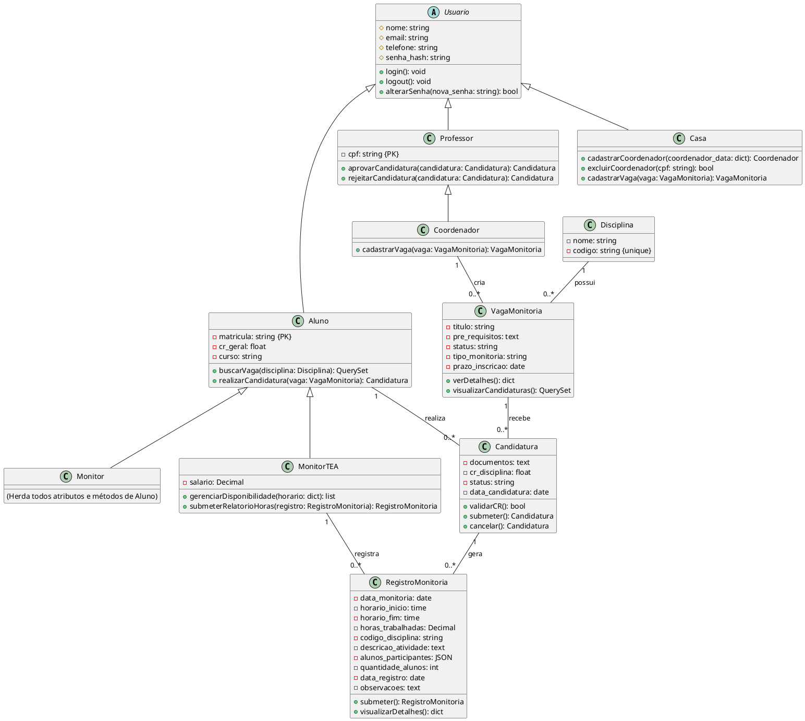
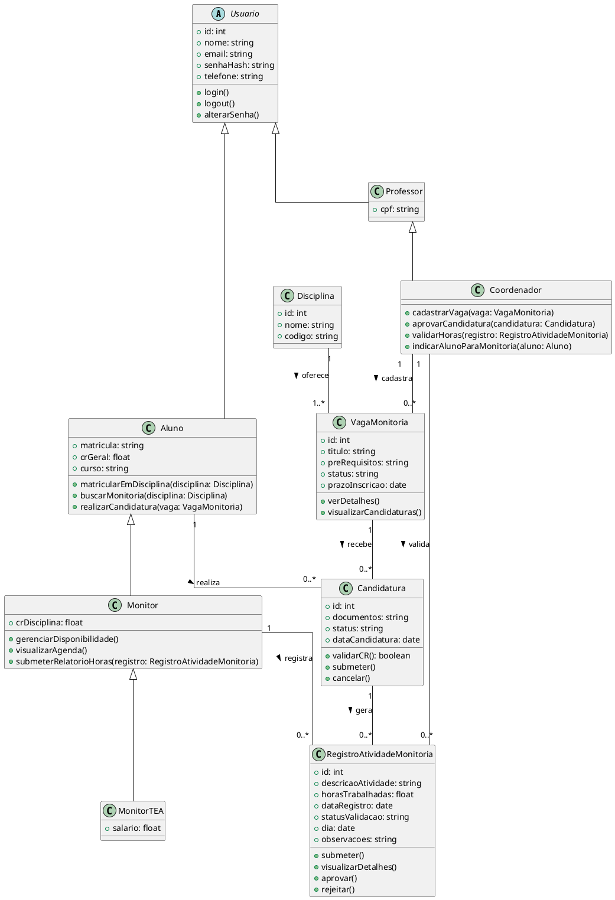

## Diagrama de Classes - Sistema de Monitoria IBMEC

### Descrição: 
Este documento apresenta o **Diagrama de Classes** atualizado da plataforma de monitoria da IBMEC. O diagrama representa todas as entidades implementadas no sistema e seus relacionamentos, refletindo fielmente a estrutura do banco de dados e lógica de negócio construída.

### **Objetivo**
O diagrama tem como objetivo documentar a arquitetura completa do sistema, definindo atributos, métodos e relacionamentos de todas as classes, garantindo consistência entre documentação e implementação.

---

## Hierarquia de Classes

```
Usuario (abstract)
├── Aluno
│   ├── Monitor
│   └── MonitorTEA
├── Professor
│   └── Coordenador
└── Casa (Administrador)
```

---

## 1. Usuario (Classe Abstrata Base)

Classe abstrata que define atributos e comportamentos comuns a todos os usuários do sistema.

**Atributos:**
- `nome`: `string` - Nome completo do usuário
- `email`: `string` - Email único para login e comunicação
- `telefone`: `string` - Telefone de contato (15 caracteres)
- `senha_hash`: `string` - Hash criptografado da senha (128 caracteres)

**Métodos:**
- `+login()`: `void` - Autentica usuário no sistema
- `+logout()`: `void` - Encerra sessão do usuário
- `+alterarSenha(nova_senha: string)`: `bool` - Altera senha do usuário

**Observações:**
- Implementada como `abstract = True` no Django
- Utiliza hash bcrypt para segurança de senhas

---

## 2. Aluno

Representa estudante matriculado que pode buscar e candidatar-se a vagas de monitoria.

**Atributos:**
- `matricula`: `string` (PK, unique) - Matrícula única do aluno (12 caracteres)
- `cr_geral`: `float` - Coeficiente de Rendimento geral do aluno
- `curso`: `string` - Curso em que está matriculado

**Métodos:**
- `+buscarVaga(disciplina: Disciplina)`: `QuerySet<VagaMonitoria>` - Retorna vagas abertas da disciplina
- `+realizarCandidatura(vagaMonitoria: VagaMonitoria)`: `Candidatura` - Cria nova candidatura

**Relacionamentos:**
- 1:N com `Candidatura` (um aluno pode ter várias candidaturas)

**Herança:** Herda de `Usuario`

**Regras de Negócio:**
- CR geral mínimo: 7.0 para candidatura
- Matrícula deve ser única no sistema

---

## 3. Monitor

Representa aluno aprovado que atua como monitor voluntário.

**Atributos:**
- Herda todos de `Aluno`

**Métodos:**
- Herda todos de `Aluno`

**Relacionamentos:**
- Criado automaticamente quando candidatura é aprovada
- Não possui registros de monitoria (apenas MonitorTEA)

**Herança:** Herda de `Aluno`

**Observações:**
- Monitor voluntário (sem remuneração)
- Criado via `Monitor.objects.get_or_create()` na aprovação

---

## 4. MonitorTEA

Monitor remunerado que registra e submete horas trabalhadas.

**Atributos:**
- `salario`: `Decimal(10,2)` - Salário mensal do monitor TEA
- Herda todos de `Aluno`

**Métodos:**
- `+gerenciarDisponibilidade(horario: dict)`: `list<dict>` - Define horários disponíveis
- `+submeterRelatorioHoras(registro: RegistroMonitoria)`: `RegistroMonitoria` - Submete relatório

**Relacionamentos:**
- 1:N com `RegistroMonitoria` (um monitor TEA tem vários registros)

**Herança:** Herda de `Aluno`

**Observações:**
- Monitor remunerado (bolsa/salário)
- Obrigatório registrar horas trabalhadas

---

## 5. Professor

Docente que aprova/rejeita candidaturas de monitoria.

**Atributos:**
- `cpf`: `string` (PK, unique) - CPF do professor (14 caracteres)

**Métodos:**
- `+aprovarCandidatura(candidatura: Candidatura)`: `Candidatura` - Aprova candidatura e cria Monitor
- `+rejeitarCandidatura(candidatura: Candidatura)`: `Candidatura` - Rejeita candidatura

**Relacionamentos:**
- Pode visualizar e gerenciar candidaturas

**Herança:** Herda de `Usuario`

**Permissões:**
- ✅ Aprovar/Rejeitar candidaturas
- ✅ Visualizar candidaturas
- ❌ Criar vagas
- ❌ Editar vagas
- ❌ Acessar dashboard completo

---

## 6. Coordenador

Professor com permissões administrativas para gerenciar vagas.

**Atributos:**
- Herda todos de `Professor`

**Métodos:**
- `+cadastrarVaga(vaga: VagaMonitoria)`: `VagaMonitoria` - Cadastra nova vaga
- Herda todos de `Professor`

**Relacionamentos:**
- 1:N com `VagaMonitoria` (coordenador cria várias vagas)

**Herança:** Herda de `Professor`

**Permissões:**
- ✅ Criar e editar vagas
- ✅ Aprovar/Rejeitar candidaturas
- ✅ Acessar dashboard completo
- ✅ Visualizar todas candidaturas
- ✅ Gerenciar monitores

---

## 7. Casa (Administrador)

Administrador do sistema com permissões totais.

**Atributos:**
- Herda todos de `Usuario`
- Identificado por `email` único

**Métodos:**
- `+cadastrarCoordenador(coordenador_data: dict)`: `Coordenador` - Cadastra novo coordenador
- `+excluirCoordenador(cpf: string)`: `bool` - Remove coordenador
- `+cadastrarVaga(vaga: VagaMonitoria)`: `VagaMonitoria` - Cria vaga
- Herda todos de `Usuario`

**Herança:** Herda de `Usuario`

**Permissões:**
- ✅ Todas as permissões do sistema
- ✅ Gerenciar coordenadores
- ✅ Criar/editar/deletar vagas
- ✅ Dashboard completo
- ✅ Aprovar/Rejeitar candidaturas

---

## 8. Disciplina

Representa disciplina acadêmica oferecida pela instituição.

**Atributos:**
- `nome`: `string` - Nome da disciplina
- `codigo`: `string` (unique) - Código único da disciplina (ex: ENG101)

**Métodos:**
- Nenhum método específico

**Relacionamentos:**
- 1:N com `VagaMonitoria` (uma disciplina pode ter várias vagas)

**Observações:**
- Criada e gerenciada via Django Admin
- Código deve ser único no sistema

---

## 9. VagaMonitoria

Vaga de monitoria criada para uma disciplina específica.

**Atributos:**
- `titulo`: `string` - Título descritivo da vaga
- `pre_requisitos`: `text` - Pré-requisitos para candidatura
- `status`: `string` - Status da vaga: 'Aberta', 'Fechada', 'Em Análise'
- `tipo_monitoria`: `string` - 'Monitor' (voluntário) ou 'MonitorTEA' (remunerado)
- `prazo_inscricao`: `date` - Data limite para candidaturas

**Métodos:**
- `+verDetalhes()`: `dict` - Retorna detalhes da vaga
- `+visualizarCandidaturas()`: `QuerySet<Candidatura>` - Lista todas candidaturas

**Relacionamentos:**
- N:1 com `Disciplina` (várias vagas para uma disciplina)
- N:1 com `Coordenador` (coordenador cria várias vagas)
- 1:N com `Candidatura` (vaga recebe várias candidaturas)

**Observações:**
- Apenas coordenadores e Casa podem criar
- Status padrão: 'Aberta'

---

## 10. Candidatura

Registro de candidatura de aluno para vaga de monitoria.

**Atributos:**
- `documentos`: `text` - Documentos/Informações adicionais do candidato
- `cr_disciplina`: `float` - CR específico na disciplina da vaga
- `status`: `string` - 'Pendente', 'Aprovada', 'Rejeitada'
- `data_candidatura`: `date` - Data da candidatura (auto)

**Métodos:**
- `+validarCR()`: `bool` - Valida se CR geral ≥ 7.0 e CR disciplina ≥ 8.0
- `+submeter()`: `Candidatura` - Submete candidatura (status: Pendente)
- `+cancelar()`: `Candidatura` - Cancela candidatura (status: Rejeitada)

**Relacionamentos:**
- N:1 com `Aluno` (aluno faz várias candidaturas)
- N:1 com `VagaMonitoria` (candidaturas para uma vaga)
- 1:N com `RegistroMonitoria` (candidatura aprovada gera registros)

**Regras de Negócio:**
- CR geral mínimo: 7.0
- CR na disciplina mínimo: 8.0
- Não permite duplicação (aluno + vaga)
- Status padrão: 'Pendente'

---

## 11. RegistroMonitoria

Registro de horas trabalhadas por Monitor TEA.

**Atributos:**
- `data_monitoria`: `date` - Data em que monitoria ocorreu
- `horario_inicio`: `time` - Hora de início
- `horario_fim`: `time` - Hora de término
- `horas_trabalhadas`: `Decimal(4,2)` - Total de horas trabalhadas
- `codigo_disciplina`: `string` - Código da disciplina
- `descricao_atividade`: `text` - Descrição do que foi ensinado
- `alunos_participantes`: `JSON` - Lista de alunos presentes (matrícula + nome)
- `quantidade_alunos`: `int` - Total de alunos participantes
- `data_registro`: `date` - Data de criação do registro (auto)
- `observacoes`: `text` (opcional) - Observações adicionais

**Métodos:**
- `+submeter()`: `RegistroMonitoria` - Salva registro no banco
- `+visualizarDetalhes()`: `dict` - Retorna todos detalhes formatados

**Relacionamentos:**
- N:1 com `MonitorTEA` (monitor TEA tem vários registros)
- N:1 com `Candidatura` (registros vinculados à candidatura aprovada)

**Observações:**
- Apenas Monitor TEA pode criar
- Ordenado por data_monitoria (DESC)
- JSON para armazenar lista dinâmica de alunos

---

## Diagrama UML Completo



---

## Multiplicidades dos Relacionamentos

| Relação | Multiplicidade | Descrição |
|---------|---------------|-----------|
| Aluno → Candidatura | 1:N | Um aluno pode ter várias candidaturas |
| VagaMonitoria → Candidatura | 1:N | Uma vaga recebe várias candidaturas |
| Coordenador → VagaMonitoria | 1:N | Um coordenador cria várias vagas |
| Disciplina → VagaMonitoria | 1:N | Uma disciplina pode ter várias vagas |
| MonitorTEA → RegistroMonitoria | 1:N | Um monitor TEA tem vários registros |
| Candidatura → RegistroMonitoria | 1:N | Candidatura aprovada gera vários registros |

---

## Constraints e Validações

### Aluno
- CR geral ≥ 7.0 para candidatura
- Matrícula única (12 caracteres)

### Candidatura
- CR disciplina ≥ 8.0 obrigatório
- Não permite duplicação (aluno + vaga)
- Status inicial: 'Pendente'

### VagaMonitoria
- Prazo de inscrição > data atual
- Status: {Aberta, Fechada, Em Análise}
- Tipo: {Monitor, MonitorTEA}

### RegistroMonitoria
- Horas trabalhadas > 0
- Data monitoria ≤ data registro
- Alunos participantes: lista JSON válida

---

## Tabela de Permissões por Perfil

| Ação | Aluno | Monitor | MonitorTEA | Professor | Coordenador | Casa |
|------|-------|---------|-----------|-----------|-------------|------|
| Ver vagas | ✅ | ✅ | ✅ | ✅ | ✅ | ✅ |
| Candidatar-se | ✅ | ❌ | ❌ | ❌ | ❌ | ❌ |
| Criar vaga | ❌ | ❌ | ❌ | ❌ | ✅ | ✅ |
| Editar vaga | ❌ | ❌ | ❌ | ❌ | ✅ | ✅ |
| Aprovar candidatura | ❌ | ❌ | ❌ | ✅ | ✅ | ✅ |
| Rejeitar candidatura | ❌ | ❌ | ❌ | ✅ | ✅ | ✅ |
| Registrar monitoria | ❌ | ❌ | ✅ | ❌ | ❌ | ❌ |
| Dashboard completo | ❌ | ❌ | ❌ | ❌ | ✅ | ✅ |
| Painel monitor | ❌ | ✅ | ✅ | ❌ | ❌ | ❌ |
| Cadastrar coordenador | ❌ | ❌ | ❌ | ❌ | ❌ | ✅ |

---

## Observações Técnicas

### Implementação Django
- **ORM**: Django Models com relacionamentos ForeignKey
- **Herança**: Multi-table inheritance e Abstract base class
- **Autenticação**: Session-based (sem Django Auth padrão)
- **Validações**: Model validators + view-level checks

### Banco de Dados
- **SGBD**: SQLite (desenvolvimento) / PostgreSQL (produção recomendado)
- **Migrations**: 3 migrations aplicadas
- **Índices**: Criados automaticamente em PKs e FKs

### Segurança
- Senhas: bcrypt hash
- Sessões: Django session framework
- CSRF: Proteção ativada
- SQL Injection: Protegido via ORM

---

**Última Atualização**: Novembro 2025  
**Versão**: 2.0 - Reflete implementação completa do sistema


**Atributos:**
- `crDisciplina`: `float` (Adicionado para consistência, se for específico do Monitor)

**Métodos:**
- `gerenciarDisponibilidade()`: `void`
- `visualizarAgenda()`: `void`
- `submeterRelatorioHoras(registro: RegistroAtividadeMonitoria)`: `void`

**Herança:** Herda de `Aluno`.

---

### 4. MonitorTEA
Representa um `Monitor` que foi aprovado para atuar como monitor remunerado (TEA - Trabalho de Ensino Assistido). Ele herda todas as características de um `Monitor` e possui um atributo específico relacionado à sua remuneração.

**Atributos:**
- `salario`: `float`

**Métodos:**
- _Nenhum método adicional específico, herda de `Monitor`._

**Herança:** Herda de `Monitor`.

---

### 5. Professor
Representa um professor da instituição, responsável por criar e gerenciar vagas de monitoria, bem como validar as atividades e horas dos monitores.

**Atributos:**
- `cpf`: `string` (Atributo adicional para o professor)

**Herança:** Herda de `Usuario`.

---

### 6. Coordenador 
Representa um professor da instituição, responsável por criar e gerenciar vagas de monitoria, bem como validar as atividades e horas dos monitores.

**Métodos:**
- `cadastrarVaga(vaga: VagaMonitoria)`: `void`
- `aprovarCandidatura(candidatura: Candidatura)`: `void`
- `validarHoras(registro: RegistroAtividadeMonitoria)`: `void`
- `indicarAlunoParaMonitoria(aluno: Aluno)`: `void`

**Herança:** Herda de `Professor`.

---

### 7. Disciplina
Representa uma disciplina acadêmica oferecida na instituição.

**Atributos:**
- `id`: `int`
- `nome`: `string`
- `codigo`: `string`

---

### 8. VagaMonitoria
Representa uma oportunidade de monitoria específica para uma disciplina, com seus requisitos, status e prazos.

**Atributos:**
- `id`: `int`
- `titulo`: `string` (Nome da vaga, mais descritivo que `nome`)
- `preRequisitos`: `string`
- `status`: `string` (Ex: "Aberta", "Fechada", "Em Análise")
- `prazoInscricao`: `date`

**Métodos:**
- `verDetalhes()`: `void`
- `visualizarCandidaturas()`: `void`

---

### 9. Candidatura
Representa o processo de um `Aluno` se candidatar a uma `VagaMonitoria`, incluindo a documentação e o status do processo.

**Atributos:**
- `id`: `int`
- `documentos`: `string` (Ex: URL para upload, ou lista de nomes de arquivos)
- `status`: `string` (Ex: "Pendente", "Aprovada", "Rejeitada")
- `dataCandidatura`: `date`

**Métodos:**
- `validarCR()`: `boolean` (Verifica se o CR do aluno atende aos requisitos)
- `submeter()`: `void`
- `cancelar()`: `void`

---

### 10. RegistroAtividadeMonitoria
Documenta as horas e atividades realizadas por um `Monitor` em uma `Monitoria` específica, aguardando validação do `Professor`.

**Atributos:**
- `id`: `int`
- `descricaoAtividade`: `string` (Melhor que `codigoDisciplina` aqui, pois a vaga já liga à disciplina)
- `horasTrabalhadas`: `float`
- `dataRegistro`: `date`
- `statusValidacao`: `string` (Melhor que `validacao: boolean` para ter mais estados como "Pendente", "Aprovado", "Rejeitado")
- `dia`: `date` (Se for diferente de `dataRegistro`)
- `observacoes`: `string` (Campo para comentários do monitor ou professor)

**Métodos:**
- `submeter()`: `void`
- `visualizarDetalhes()`: `void`
- `aprovar()`: `void` (Ação que o professor faria)
- `rejeitar()`: `void` (Ação que o professor faria)

---

## Visão Geral dos Relacionamentos

### Heranças
- `Usuario` é a classe base para `Aluno` e `Professor`.
- `Aluno` é a classe base para `Monitor`.
- `Monitor` é a classe base para `MonitorTEA`. (Um `MonitorTEA` é um tipo específico de `Monitor`, que por sua vez é um `Aluno`.)


### Associações
- **Disciplina → VagaMonitoria**: Uma disciplina oferece uma ou mais vagas (1 → 1..*)
- **Professor → VagaMonitoria**: Um professor cadastra zero ou mais vagas (1 → 0..*)
- **Aluno → Candidatura**: Um aluno realiza zero ou mais candidaturas (1 → 0..*)
- **VagaMonitoria → Candidatura**: Uma vaga recebe zero ou mais candidaturas (1 → 0..*)
- **Candidatura → RegistroAtividadeMonitoria**: Uma candidatura gera zero ou mais registros (1 → 0..*)
- **Professor → RegistroAtividadeMonitoria**: Um professor valida zero ou mais registros (1 → 0..*)
- **Monitor → RegistroAtividadeMonitoria**: Um monitor registra zero ou mais atividades (1 → 0..*)




## **Autor(es)**
| Data | Versão | Descrição | Autor(es) |
|-------|--------|-----------|------------|
| 18/09/2025 | 1.0 | Criação do documento | João Mariano e Sarah Ferrari.
| 16/10/2025 | 2.0 | Aprimoramento do documento | João Victor de C.
| 22/10/2025 | 3.0 | Aprimoramento do documento | João Victor de C.
