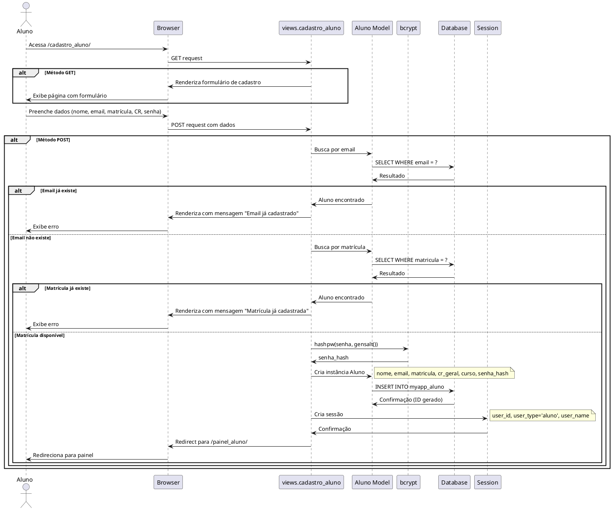
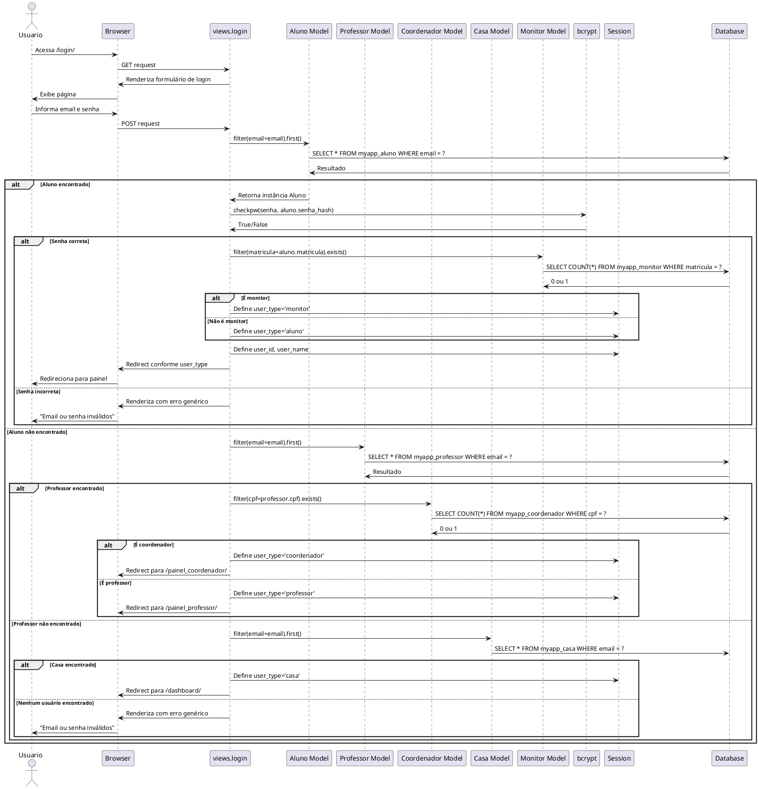
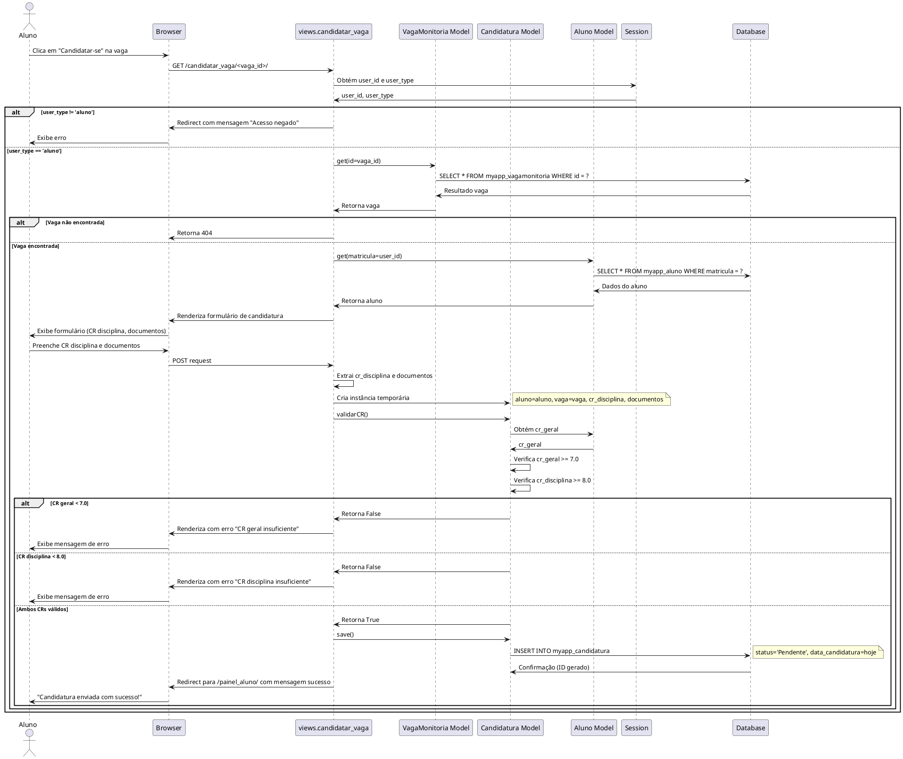
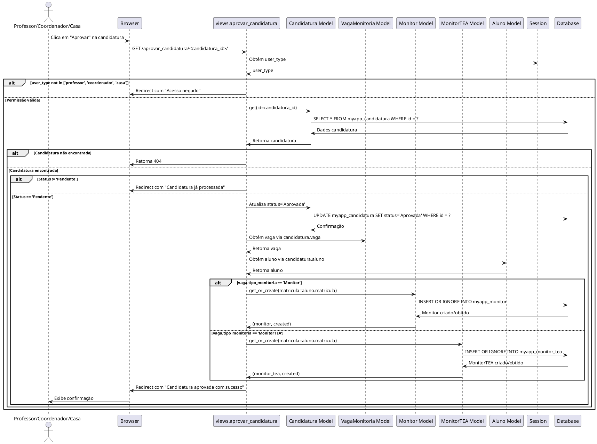
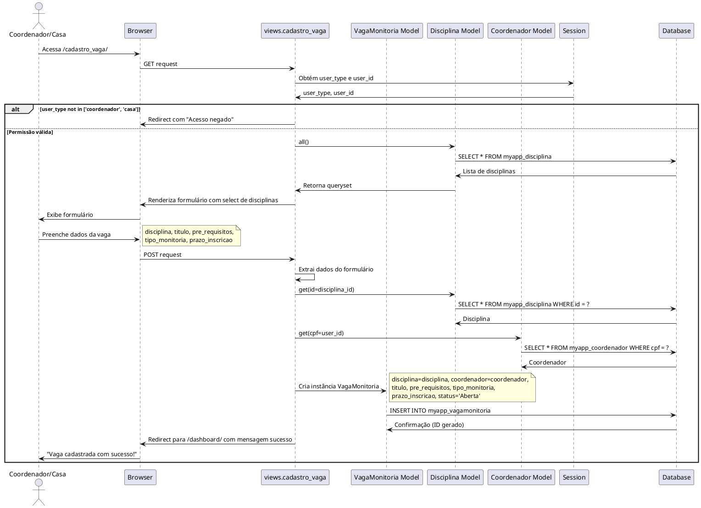

# Diagramas de Sequência - Sistema de Monitoria IBMEC

## Descrição
Este documento apresenta os **Diagramas de Sequência** dos principais fluxos implementados no Sistema de Monitoria IBMEC. Cada diagrama representa fielmente as interações entre objetos, métodos e camadas do sistema conforme desenvolvido.

---

## DS01 - Cadastro de Aluno

Representa o fluxo completo desde o acesso à página de cadastro até a criação do registro e autenticação automática.



**Objetos Envolvidos:**
- `Aluno` (usuário)
- `views.cadastro_aluno` (controlador)
- `Aluno Model` (modelo Django)
- `bcrypt` (biblioteca de criptografia)
- `Database` (SQLite/PostgreSQL)
- `Session` (Django session framework)

**Mensagens Principais:**
1. GET: Renderiza formulário
2. POST: Valida email → Valida matrícula → Criptografa senha → Cria registro → Autentica → Redireciona

---

## DS02 - Login de Usuário

Representa autenticação multi-perfil com identificação automática do tipo de usuário.



**Fluxo de Decisão:**
1. Busca em Aluno → Se encontrado, verifica se é Monitor
2. Se não encontrado, busca em Professor → Verifica se é Coordenador
3. Se não encontrado, busca em Casa
4. Se nada encontrado, retorna erro genérico (segurança)

---

## DS03 - Candidatura a Vaga

Representa o fluxo completo de candidatura com validação automática de CR.



**Validações Implementadas:**
- Permissão: Apenas aluno pode candidatar-se
- CR geral ≥ 7.0
- CR disciplina ≥ 8.0
- Vaga deve existir e estar aberta

---

## DS04 - Aprovar Candidatura

Representa aprovação de candidatura por professor/coordenador/casa com criação automática de Monitor.



**Lógica Implementada:**
- Verifica permissões (professor/coordenador/casa)
- Atualiza status da candidatura
- Cria Monitor ou MonitorTEA conforme tipo da vaga
- Usa `get_or_create` para evitar duplicação

---

## DS05 - Cadastrar Nova Vaga

Representa criação de vaga por coordenador ou Casa.



**Validações:**
- Apenas coordenadores e Casa podem criar
- Disciplina deve existir
- Prazo deve ser futuro (validação HTML5)
- Status inicial sempre 'Aberta'

---

## Matriz de Mensagens e Métodos

| Diagrama | Objeto Origem | Mensagem | Objeto Destino | Tipo Retorno |
|----------|---------------|----------|----------------|--------------|
| DS01 | View | `filter(email=email).first()` | Aluno Model | Aluno ou None |
| DS01 | View | `hashpw(senha, gensalt())` | bcrypt | bytes |
| DS01 | Aluno Model | `save()` | Database | void |
| DS02 | View | `checkpw(senha, hash)` | bcrypt | bool |
| DS02 | View | `exists()` | Monitor Model | bool |
| DS03 | Candidatura | `validarCR()` | self | bool |
| DS03 | Candidatura | `save()` | Database | void |
| DS04 | View | `get_or_create(matricula=x)` | Monitor Model | (Monitor, bool) |
| DS05 | View | `all()` | Disciplina Model | QuerySet |
| DS05 | VagaMonitoria | `save()` | Database | void |

---

## Padrões de Sequência Identificados

### 1. Padrão de Autenticação
```
GET → Renderiza formulário → POST → Valida credenciais → Cria sessão → Redireciona
```

### 2. Padrão de CRUD
```
GET → Renderiza formulário → POST → Valida dados → Salva no banco → Redireciona com mensagem
```

### 3. Padrão de Validação de Permissão
```
Request → Obtém user_type da sessão → Verifica permissão → Permite/Nega acesso
```

### 4. Padrão de Criação Automática
```
Aprovação → Verifica tipo monitoria → get_or_create() → Retorna (objeto, created)
```

---

## Observações Técnicas

### Otimizações de Query
- **select_related()**: Usado em dashboard para reduzir queries N+1
- **filter().count()**: Mais eficiente que len(filter())
- **get_or_create()**: Evita duplicação e reduz lógica condicional

### Segurança Implementada
- Hash bcrypt para senhas
- Validação de permissões em todas as views protegidas
- Mensagens genéricas em falhas de login
- Session-based authentication

### Transações
- Django ORM garante atomicidade em operações de save()
- Aprovação de candidatura + criação de monitor é atômica

---

**Última Atualização**: Novembro 2025  
**Versão**: 2.0 - Reflete implementação real do sistema
